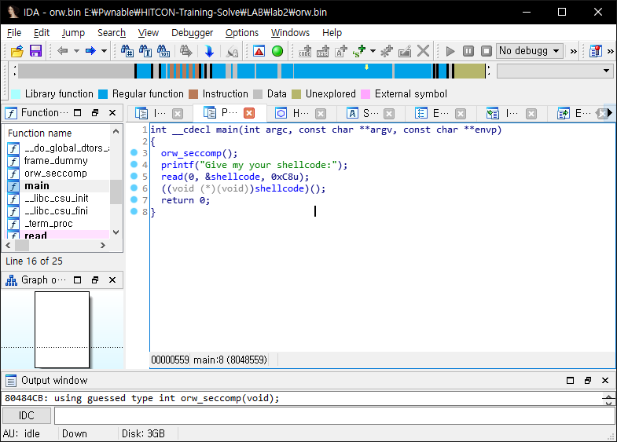
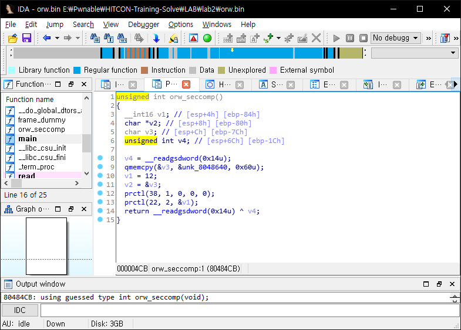

# HITCON-Training lab2

## binary analysis





Look this [document](https://en.wikipedia.org/wiki/Seccomp) to learn about `seccomp`

`seccomp` is make me only use `exit()`, `sigreturn()`, `read()` and `write()`.

## solve

> Not solved.. maybe later!

```python

```


## flag

`CTF{debugger_1s_so_p0werful_1n_dyn4m1c_4n4lySis!}`